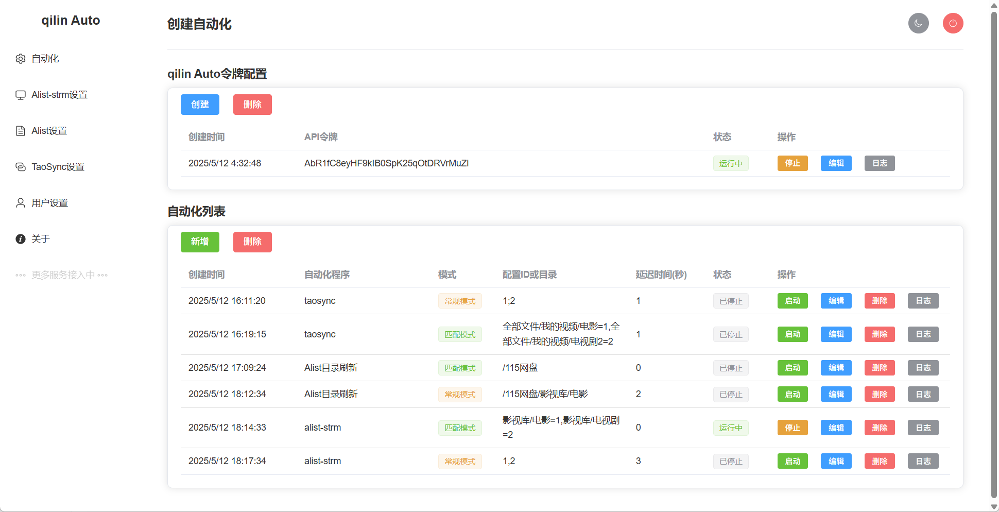

# qilin-Auto 影视库自动化任务管理平台


## 🌟 项目简介
影视库自动化解决方案，实现了网盘文件实时生成strm文件，Cloudsaver保存文件后，自动通知Alist目录刷新，还有Alist-strm自动生成strm文件，不依赖定时任务，减少访问网盘的次数和提高执行效率。

## 🚀 核心功能
- **Alist目录智能刷新**  
  实时监控Cloudsaver保存文件动作，自动触发媒体库更新
- **多任务协同调度**  
  支持Alist-strm/TaoSync(未来)任务并行执行，网盘文件转存后自动生成strm或同步下载文件
- **日志全景监控**  
  提供实时日志追踪与历史记录查询，错误智能预警

## 🛠 技术架构
### 前端技术栈
- Vue 3 + Element Plus  
  SPA应用框架与UI组件库
- Vite  
  下一代前端构建工具

### 后端技术栈
- Node.js + Express  
  高性能服务端框架
- 文件系统监控  
  基于inotify的目录监听机制

## 📦 安装部署

### 源码部署

#### 1.克隆仓库
```bash
git clone https://github.com/your-repo/qilin-auto.git
cd qilin-auto
```
#### 2.安装依赖
```bash
npm install
cd server && npm install
```
#### 3.启动后端服务
```bash
node server.js
```
#### 4.启动前端服务
```bash
cd ..
npm run dev
```

### Docker部署（推荐）

#### 1.alist-strm(带api接口)docker compose部署
```bash
version: "3"
services:
    alist-strm:
        stdin_open: true
        tty: true
        volumes:
            - ./video:/volume1/video  #./video为挂载网盘的本地路径，请根据实际路径修改
            - ./config:/config  #./config为宿主机配置文件夹路径，可以不修改
        ports:
            - "5000:5000"
        container_name: alist-strm-api
        restart: always
        image: qilinzhu/alist-strm:latest
        network_mode: bridge
```
#### 2.qilin Auto进行docker compose部署
```bash
version: '3'
services:
  qilin-auto:
    container_name: qilin-auto
    image: qilinzhu/qilin-auto:latest
    ports:
      - "9090:9090"
      - "9009:9009"
    volumes:
      - /vol1/1000/cloudsaver/logs:/app/logs  #/vol1/1000/cloudsaver/logs为cloudsaver的宿主机日志文件夹，请根据实际路径修改
      - ./data:/app/server/data  #./data为宿主机数据文件夹路径，可以不修改
    restart: always
    environment:
      - NODE_ENV=production
```
#### 注意：1.cloudsaver容器需提前设置文件映射，"/vol1/1000/cloudsaver/logs:/app/logs", 
<pre>
#### 2.下载Releases页面的config.json,复制到宿主机数据文件夹(如./data)。
<pre>
  
#### 3.启动容器
```bash
docker-compose up -d
```


## 🔧 使用指南
1. **打开网页**   
   http://localhost:9090,初始用户名:admin，初始密码:admin123
2. **监控配置**  
   创建cloudsaver日志监控，输入路径/app/logs/combined.log，创建后点击"日志"按钮，查看是否生效
3. **程序api-key设置**  
   点击边侧栏，分别填入Alist和Alist-strm的api令牌，Alist-strm的api令牌在该程序的"其他"页面
4. **自动化任务创建**  
   在「自动化列表」中配置Alist-strm/Alist目录刷新任务，每个任务可以设置延时触发时间
5. **检验自动化任务**  
   登录cloudsaver保存任一文件，打开Alist刷新设置的目录，如果显示保存的目录即为生效，
   打开Alist-strm的配置列表，查看对应配置的日志，如果日志有变化即为生效

## QQ交流群
答疑和最新文件都在群里，784295077

## 📄 开源协议
本项目采用 [MIT License](LICENSE)
